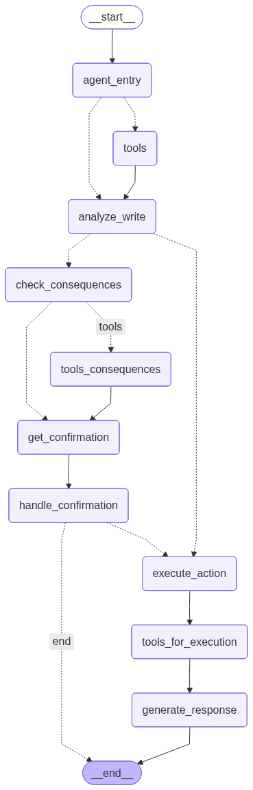

# Movi - Intelligent Transport Management Assistant

Movi is an AI-powered transport management system that provides intelligent assistance for route management, trip scheduling, and vehicle assignments. The system features a multimodal conversational interface (text, voice, and image) built with LangGraph for stateful agent workflows and Human-in-the-Loop (HITL) confirmation patterns.

## 📋 Table of Contents

- [Architecture Overview](#architecture-overview)
- [LangGraph Design](#langgraph-design)
- [Setup Instructions](#setup-instructions)
- [Project Structure](#project-structure)
- [Usage](#usage)
- [Technologies Used](#technologies-used)

## 🏗️ Architecture Overview

Movi follows a **three-tier architecture**:

### Frontend (React + TypeScript)
- **Framework**: React 18 with TypeScript
- **UI Library**: shadcn/ui components with Tailwind CSS
- **Routing**: React Router DOM
- **State Management**: React Query (TanStack Query)
- **Features**:
  - Real-time chat interface with Movi assistant
  - Voice input/output (ASR/TTS)
  - Image upload support
  - Dashboard for bus management, route management, and trip tracking

### Backend (Flask + Python)
- **Framework**: Flask 3.0 with CORS support
- **AI Agent**: LangGraph-based conversational agent
- **LLM**: Google Gemini 2.5 Flash
- **Features**:
  - RESTful API endpoints for database operations
  - Multimodal message processing (text/audio/image)
  - Stateful conversation management with thread persistence
  - Human-in-the-Loop confirmation workflows

### Database (SQLite)
- **Database**: SQLite (`moveinsync.db`)
- **Schema**: 7 core tables:
  - `Stops`: Bus stop locations with coordinates
  - `Paths`: Ordered sequences of stops
  - `Routes`: Route definitions with shift times and capacity
  - `Vehicles`: Vehicle inventory with license plates
  - `Drivers`: Driver information
  - `DailyTrips`: Trip schedules with booking status
  - `Deployments`: Vehicle and driver assignments to trips

## 🔄 LangGraph Design

Movi uses **LangGraph** to orchestrate a stateful, multi-step agent workflow with conditional routing and Human-in-the-Loop interruptions.

### Agent State (`AgentState`)

The agent state is a `TypedDict` that persists across all nodes:

```python
class AgentState(TypedDict):
    messages: Annotated[list[BaseMessage], add_messages]  # Conversation history
    pending_action: str                                  # SQL query to execute after confirmation
    requires_confirmation: bool                          # Flag for write operations needing approval
    awaiting_confirmation: bool                          # Flag indicating waiting for user response
    current_page: str                                    # Frontend page context (busDashboard/manageRoute/home)
    image_path: Optional[str]                           # Path to uploaded image for multimodal input
```

**Key Design Principle**: All node functions use `**state` spread to preserve all state fields, ensuring no data loss during transitions.

### Graph Nodes

The workflow consists of **9 nodes**:

1. **`agent_entry`**: Entry point that analyzes user intent using LLM with tool bindings
   - Determines if request is READ or WRITE operation
   - Routes to `tools` (for queries) or `analyze_write` (for modifications)

2. **`tools`**: ToolNode executing SQL queries (`execute_sql_query`, `execute_sql_write`)
   - Used for initial READ operations

3. **`analyze_write`**: LLM analyzes write operations to determine if consequence checking is needed
   - Extracts SQL query and stores in `pending_action`
   - Sets `requires_confirmation` flag

4. **`check_consequences`**: LLM queries database to assess impact of pending write operation
   - Checks booking percentages, affected trips, potential cancellations
   - Uses `execute_sql_query` tool to gather data

5. **`tools_consequences`**: ToolNode for consequence checking queries
   - Executes SELECT queries to analyze impact

6. **`get_confirmation`**: LLM generates user-friendly confirmation message with consequences
   - Formats specific details (booking percentages, trip names, affected records)
   - Sets `awaiting_confirmation = True`

7. **`handle_confirmation`**: Parses user's yes/no response
   - If "yes": Preserves `pending_action`, clears confirmation flags
   - If "no": Cancels action, clears `pending_action`
   - **Critical**: Uses `**state` to preserve all fields

8. **`execute_action`**: Executes the pending SQL write operation
   - Uses `pending_action` from state
   - Calls `execute_sql_write` tool

9. **`tools_for_execution`**: ToolNode for final write execution
   - Executes INSERT/UPDATE/DELETE queries

10. **`generate_response`**: LLM generates final natural language response
    - Summarizes query results or execution outcomes

### Conditional Edges & Routing

The graph uses **4 conditional routing functions**:

1. **`route_after_entry`**: Routes from `agent_entry`
   - **→ `tools`**: If LLM called a tool (READ operation)
   - **→ `analyze_write`**: If LLM detected a write operation

2. **`route_after_analyze`**: Routes from `analyze_write`
   - **→ `check_consequences`**: If `requires_confirmation = True`
   - **→ `execute_action`**: If no consequences detected

3. **`route_after_consequences`**: Routes from `check_consequences`
   - **→ `tools_consequences`**: If LLM called tool (needs more queries)
   - **→ `get_confirmation`**: If consequence analysis complete

4. **`route_after_confirmation`**: Routes from `handle_confirmation`
   - **→ `execute_action`**: If user confirmed (`awaiting_confirmation = False`)
   - **→ `end`**: If still awaiting or user cancelled

### Human-in-the-Loop (HITL) Pattern

The graph implements **interrupt-based HITL**:

- **Interrupt Point**: `interrupt_before=["handle_confirmation"]`
- **Checkpointing**: Uses `MemorySaver()` to persist state between requests
- **Thread Persistence**: Each conversation uses a unique `thread_id` for state continuity
- **Resume Logic**: When user replies "yes/no", the graph resumes from `handle_confirmation` with full state preserved

**Flow Example**:
```
User: "Remove Vehicle KA-07-MN-6789"
  → agent_entry → analyze_write → check_consequences → get_confirmation
  → [INTERRUPT] Graph pauses, user sees confirmation message
User: "yes"
  → handle_confirmation → execute_action → tools_for_execution → generate_response → END
```

### Graph Visualization

The complete workflow is visualized in `movi/movi_graph.png`:



**Key Features**:
- **Conditional branching** based on operation type and user confirmation
- **Tool execution nodes** for database interactions
- **State persistence** across all transitions
- **Interrupt point** for human approval

## 🚀 Setup Instructions

### Prerequisites

- **Python 3.10+** (Python 3.11+ recommended)
- **Node.js 18+** and npm
- **Google Gemini API Key** (for LLM)

### Backend Setup

1. **Clone the repository**:
   ```bash
   git clone <repository-url>
   cd <project-directory>
   ```

2. **Create a virtual environment**:
   ```bash
   python -m venv venv
   source venv/bin/activate  # On Windows: venv\Scripts\activate
   ```

3. **Install Python dependencies**:
   ```bash
   pip install -r requirements.txt
   ```

4. **Set up environment variables**:
   Create a `.env` file in the project root:
   ```env
   GOOGLE_API_KEY=your_google_gemini_api_key_here
   ```

5. **Initialize the database** (optional):
   The database will be created automatically on first run. To reset with sample data, uncomment the initialization code in `app.py`.

6. **Run the Flask backend**:
   ```bash
   python app.py
   ```
   The API will be available at `http://localhost:5000`

### Frontend Setup

1. **Navigate to frontend directory**:
   ```bash
   cd frontend
   ```

2. **Install Node.js dependencies**:
   ```bash
   npm install
   ```

3. **Start the development server**:
   ```bash
   npm run dev
   ```
   The frontend will be available at `http://localhost:5173` (or the port shown in terminal)

### Verify Installation

1. **Backend**: Check `http://localhost:5000/api/stats` - should return JSON with trip/vehicle/driver counts
2. **Frontend**: Open `http://localhost:5173` - should show the Movi dashboard
3. **Movi Chat**: Click the chat icon and send a test message like "How many vehicles are there?"

## 📁 Project Structure

```
.
├── app.py                      # Flask backend server
├── requirements.txt            # Python dependencies
├── moveinsync.db              # SQLite database
├── .env                       # Environment variables (create this)
│
├── movi/                      # LangGraph agent module
│   ├── __init__.py
│   ├── chat.py                # Main agent graph definition
│   ├── asr.py                 # Audio transcription (Whisper)
│   ├── tts.py                 # Text-to-speech (gTTS)
│   └── movi_graph.png         # Graph visualization
│
└── frontend/                  # React frontend
    ├── package.json
    ├── vite.config.ts
    ├── src/
    │   ├── main.tsx           # Entry point
    │   ├── App.tsx            # Main app component
    │   ├── components/
    │   │   ├── Movi/
    │   │   │   ├── MoviChat.tsx      # Chat interface
    │   │   │   └── MoviResponse.tsx  # Response display
    │   │   └── ui/            # shadcn/ui components
    │   ├── pages/
    │   │   ├── BusDashboard.tsx
    │   │   ├── ManageRoute.tsx
    │   │   └── Home.tsx
    │   └── lib/
    │       └── api.ts         # API client
```

## 💡 Usage

### Basic Chat Interaction

1. Open the Movi chat interface (chat icon in sidebar)
2. Type a query: `"How many active routes are there?"`
3. Movi will query the database and respond with natural language

### Write Operations with Confirmation

1. Request a modification: `"Remove Vehicle KA-07-MN-6789 from all Tables"`
2. Movi will:
   - Analyze the request
   - Check consequences (bookings, trip impacts)
   - Show a confirmation prompt with details
3. Reply `"yes"` to proceed or `"no"` to cancel
4. Movi executes the action and confirms completion

### Multimodal Input

- **Text**: Type directly in the chat input
- **Voice**: Click the microphone icon to record audio
- **Image**: Click the image icon to upload a screenshot/photo

### Context-Aware Responses

Movi adapts based on the current page:
- **Bus Dashboard**: Focuses on live trips, vehicle assignments, driver status
- **Manage Route**: Prioritizes route/path creation and analysis
- **Home**: Provides summaries and overviews

## 🛠️ Technologies Used

### Backend
- **Flask 3.0**: Web framework
- **LangGraph 0.0.20**: Stateful agent orchestration
- **LangChain**: LLM integration and tool bindings
- **Google Gemini 2.5 Flash**: LLM for agent reasoning
- **SQLite**: Database
- **OpenAI Whisper**: Speech-to-text (ASR)
- **gTTS**: Text-to-speech (TTS)

### Frontend
- **React 18**: UI framework
- **TypeScript**: Type safety
- **Vite**: Build tool
- **Tailwind CSS**: Styling
- **shadcn/ui**: Component library
- **React Router**: Navigation
- **TanStack Query**: Data fetching
- **Recharts**: Data visualization

## 📝 Notes

- **Thread Persistence**: Each conversation maintains state via `thread_id`. The frontend stores and sends this ID with each message to enable multi-turn conversations.
- **State Preservation**: All node functions use `**state` spread to ensure no state fields are lost during transitions.
- **Confirmation Flow**: Write operations that affect bookings or active trips require explicit user confirmation via HITL interrupt pattern.

## 🤝 Contributing

Contributions are welcome! Please ensure:
- Code follows existing patterns (state preservation, error handling)
- All node functions preserve state using `**state`
- Thread persistence is maintained for multi-turn conversations

## 📄 License

[Specify your license here]

---

**Built with using LangGraph and React**